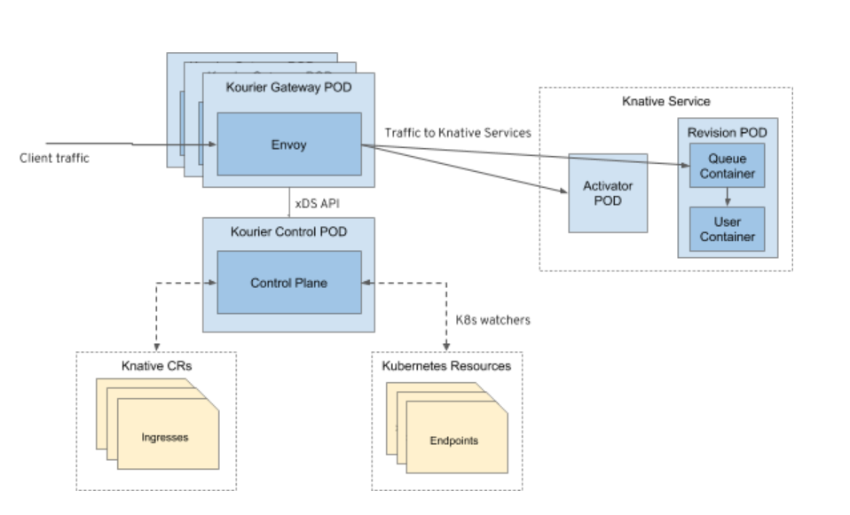

# 2 - Installing Knative

A Minikube "cluster" has been created in the previous section.

Installation of Knative is covered in the [Knative Administartion guide](https://knative.dev/docs/admin/install/serving/install-serving-with-yaml/). We will install Knative Serving in this section using Kourier as networking layer.

**Important:** Check the output of every command that you executed for errors! Do not blindly run command after command.

### Installing the Serving component 

1. Install the Knative Serving Custom Resource Definitions (aka CRDs):

      ```sh
      kubectl apply -f https://github.com/knative/serving/releases/download/knative-v1.8.3/serving-crds.yaml
      ```

1. Install the core components of Knative Serving:

      ```sh
      kubectl apply -f https://github.com/knative/serving/releases/download/knative-v1.8.3/serving-core.yaml
      ```

### Installing Kourier as networking layer

Knative [requires a networking layer with an Ingress](https://knative.dev/docs/admin/install/serving/install-serving-with-yaml/#install-a-networking-layer) that is not part of the Knative installation itself. There are several options, Istio is one of them, another one is [Kourier](https://github.com/knative/net-kourier) which was developed originally by 3Scale which is now a part of Red Hat. Kourier is now maintained by the Knative project itself. Other networking options are Ambassador, Contour, Glue, and Kong. 

We will use Kourier in this lab, you can find more information about Kourier in this [Red Hat blog](https://developers.redhat.com/blog/2020/06/30/kourier-a-lightweight-knative-serving-ingress/).



The following commands install Kourier and enable its Knative integration.

1. Install the Knative Kourier controller:

      ```
      kubectl apply -f https://github.com/knative/net-kourier/releases/download/knative-v1.8.1/kourier.yaml
      ```

1. Configure Knative Serving to use Kourier by default:

      ```
      kubectl patch configmap/config-network \
      --namespace knative-serving \
      --type merge \
      --patch '{"data":{"ingress-class":"kourier.ingress.networking.knative.dev"}}'
      ```

1. Check the External IP:

      ```
      kubectl --namespace kourier-system get service kourier
      ```

      Result should show the external IP as `<pending>` which is normal for Minikube.

1. Verify the installation:

   List all pods in the knative-serving namespace:


   ```
   kubectl get pods -n knative-serving
   kubectl get pods -n kourier-system
   ```

   All pods should be in status "Running":

   ```
      NAME                                      READY   STATUS    RESTARTS   AGE
      activator-848b54764c-lf5tz                1/1     Running   0          5m14s
      autoscaler-6c9d98bfc7-5wbw6               1/1     Running   0          5m14s
      controller-74cffd4749-njgv7               1/1     Running   0          5m14s
      domain-mapping-5557d5d995-nq49r           1/1     Running   0          5m14s
      domainmapping-webhook-646496fddc-c7258    1/1     Running   0          5m13s
      net-kourier-controller-85657dfb57-7b7t5   1/1     Running   0          3m39s
      webhook-55868d7455-hng8l                  1/1     Running   0          5m13s

      NAME                                      READY   STATUS    RESTARTS   AGE
      3scale-kourier-gateway-77849dcc96-hqd99   1/1     Running   0          64s
   ```   

         

### Configure "Magic" DNS

Knative ships a simple Kubernetes Job called “default domain” that will configure Knative Serving to use [sslip.io](http://sslip.io/){:target="_blank"} as the default DNS suffix.

*Note:* The default domain used to be 'xip.io' but this suddenly [stopped working](https://github.com/knative/serving/issues/11297).

1. Apply the Kubernetes job:

      ```
      kubectl apply -f https://github.com/knative/serving/releases/download/knative-v1.8.3/serving-default-domain.yaml
      ```

2. Create a Minikube tunnel, this requires administrator rights on your workstation. 
   
   Enter the following command in **another** terminal session:

      ```
      minikube tunnel
      ```      

      **Keep this session open and 'minikube tunnel' running during the whole workshop!**

3. Check the External IP again:

      ```
      kubectl --namespace kourier-system get service kourier
      ```

      Result should show the external IP equal to the Cluster IP of the service, e.g. `10.103.104.209`. 

      This makes the Knative services reachable on your notebook via the DNS entry `*.10.103.104.209.sslip.io`.

      Test if this works (with your own external IP address!):

      ```
      ping 10.103.104.209.sslip.io
      ```

      Result, e.g.:

      ```
      PING 10.103.104.209.sslip.io (10.103.104.209) 56(84) bytes data.
      From 192.168.49.2 (192.168.49.2) icmp_seq=2 Host redirect (New nexthop: 1.49.168.192 (1.49.168.192))
      ```

      Terminate the PING with Ctl-C (Cmd-C) once you see that it works = is able to resolve to a local address.

      How does this work: A DNS request for e.g. helloworld.10.103.104.209.sslip.io will resolve to IP address 10.103.104.209. This IP address is made available by `minikube tunnel` and is answered via the Kourier ingress gateway. It's magic :-)

      **NOTE**: If the PING of the sslip.io address fails (name or service unkown, DNS request timeout, etc.), most likely your router is configured to protect against DNS Rebind attacks. For AVM Fritz!Box follow [these directions](https://avm.de/service/wissensdatenbank/dok/FRITZ-Box-7390/663_DNS-Auflosung-privater-IP-Adressen-nicht-moglich/). This remedy seems to require a restart of your Fritz!Box. I own a Fritz!Box and it still doesn't work for me.  **At the time of this writing it worked without problems on bwLehrPool.**

      **Note 2**: If this still does not work, use the information provided by the Knative documentation [here](https://knative.dev/docs/install/yaml-install/serving/install-serving-with-yaml/#configure-dns) in section "Configure DNS", tab "Temporary DNS". With this method you cannot access the Knative examples in the browser, though, only `curl` will work like this:

      1. Use the External IP address of the `kourier`service
   
            ```
            kubectl --namespace kourier-system get service kourier

            NAME      TYPE           CLUSTER-IP    EXTERNAL-IP   PORT(S)                      AGE
            kourier   LoadBalancer   10.97.35.18   10.97.35.18   80:32275/TCP,443:30793/TCP   8m37s
            ```

            In this example it would be `10.97.35.18`. The External IP address only shows while `minikube tunnel` is active!


      2. Use the URL from `kn service list`, in this workshop this should always be `http://helloworld.kntest.example.com`

      3. Call the URL like this:
   
            `curl -H "Host: helloworld.kntest.example.com" http://10.97.35.18`

            With this method, you call the service on the IP address of the Kourier service (the ingress) and set the hostname in the IP header of the call using the `-H` flag.
            
### Quick Install

Now that you have learned how to install Knative onto a Kubernetes cluster here is the fast path:

In the code/install directory is a (Bash) script that will install Knative, Kourier, and one of the two DNS options (sslip.io or example.com):

      `install/install-knative.sh`

This should be especially helpful if you loose your bwLehrPool session and have to start over again. :-)

__Continue with the next part [3 - Deploy a Knative Service](../workshop/3-DeployKnativeService)__      

